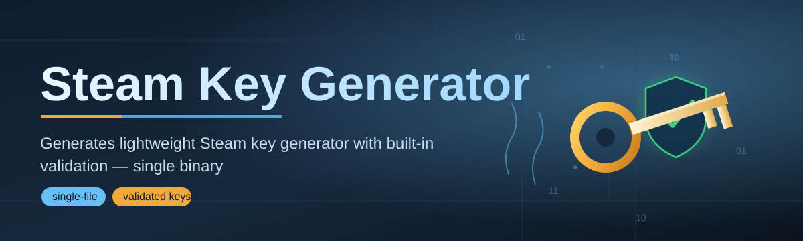
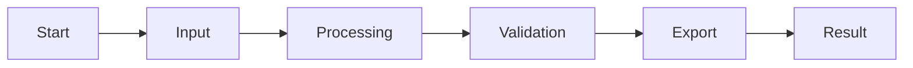

# steam-key-generator-tool 🎮⚡

  

*A single weekend, one caffeinated dev, and a tool that turns "I wish this existed" into a double-click.*

  

## 🌙 The Origin Story

**Built solo. Shipped fast. No corporate roadmap, no committee meetings — just a dev who needed a better way to manage Steam key workflows and decided to build it in a weekend.**

Click for the full (slightly unhinged) backstory

 

It started with a spreadsheet. A messy, color-coded, half-broken spreadsheet full of key codes, redemption statuses, and a formula that broke every time someone added a row. I was helping a small indie studio track bundle giveaways and press key distributions, and I thought: "this should not require a PhD in Excel."

So I opened a blank project on a Friday night, told myself "just a quick utility," and by Sunday afternoon I had a fully working desktop app with a UI, batch generation logic, export pipelines, and a dark mode I was way too proud of. This repo is that weekend, polished up and open-sourced because gatekeeping a tool this small felt silly.

steam-key-generator-tool isn't trying to be an enterprise platform. It's trying to be the thing you open, use for ninety seconds, and close — feeling like your time was respected.

---

## 📖 Overview

**steam-key-generator-tool** is a lightweight Windows desktop utility built for one purpose: making Steam key generator workflows fast, structured, and painless. If you've ever managed a batch of promotional codes, organized press keys for a game launch, or needed a clean local system to track key inventories without duct-taping together three different spreadsheets and a Discord bot, this tool exists for you.

The Steam key ecosystem is deceptively complex once you're past the "here's one code" stage. Developers running giveaways, community managers distributing review copies, and small studios coordinating launch marketing all hit the same wall — there's no dead-simple, standalone tool that handles key organization, formatting, and export without demanding an account, a subscription, or an internet connection. This project fills that gap directly. It's built for solo devs, indie studios, community managers, and hobbyist tool-tinkerers who want something that works the moment they open it.

What makes this different from the pile of half-abandoned scripts floating around GitHub is that it's actually maintained, actually documented, and actually designed with a UI that doesn't feel like a 2009 Java Swing project. Every feature below was built because a real workflow needed it — not because it looked good on a feature list.

> [!TIP]
> New here? Skip straight to **Up and Running** below — it's three clicks and you're generating.

## 🚀 What It Actually Does

- **Batch Key Structuring** — Organize large sets of Steam key generator output into clean, exportable formats instead of wrangling loose text files.

- **Local-First Architecture** — Everything runs on your machine. No cloud sync, no account creation, no mystery server logging your activity.

- **Smart Duplicate Detection** — Cross-references entries in real time so you never accidentally distribute the same code twice.

- **One-Click CSV & TXT Export** — Get your key sets into whatever spreadsheet or distribution pipeline you already use, formatted and ready.

- **Session History Panel** — A scrollable log of everything generated this session, because "wait, what did I already export" is a universal developer pain.

- **Custom Naming Templates** — Tag batches by campaign, game title, or date so your key inventory doesn't turn into alphabet soup.

- **Dark & Light Theme Toggle** — Because at 2am you want dark mode, and at a client demo you want something that doesn't look like a hacker movie prop.

- **Zero-Dependency Standalone Build** — No runtime installs, no background services. Download, run, done.

---

## 🧭 Up and Running

> [!NOTE]
> This is a standalone Windows application. There's no package manager step, no terminal commands, nothing to configure before your first run.

1. Visit the **landing page** using the download button above.

2. Grab the latest build for Windows 10/11.

3. Run the executable — Windows SmartScreen may flag it since it's an indie-signed build; click "More Info → Run Anyway."

4. You're in. Start generating, exporting, and organizing immediately.

> [!TIP]
> Pin the app to your taskbar if you manage keys regularly — most users end up using this weekly during launch windows or giveaway seasons.

---

## 💻 System Requirements

| Requirement | Details |
|---|---|
| OS | Windows 10 or Windows 11 (64-bit) |
| Dependencies | None — fully standalone executable |
| RAM | 2GB minimum |
| Disk Space | Under 50MB |
| Internet | Not required after download |

---

## ⚙️ How It Works

The internal flow is intentionally simple — three moving parts, no hidden magic:

1. **Input Stage** — You define batch parameters (quantity, naming template, format).

2. **Processing Core** — The generator engine builds and validates the batch structure locally.

3. **Duplicate Pass** — Session history is cross-checked to prevent repeat entries.

4. **Export Stage** — Clean output is written to CSV/TXT in your chosen directory.

5. **Session Log Update** — The history panel refreshes so your next batch stays organized.

---

## 🧩 Troubleshooting

**Q: The app won't open and Windows shows a security warning.**
A: This is standard for indie-signed executables. Click "More Info" then "Run Anyway" in the SmartScreen prompt.

**Q: My export file is empty after generating a batch.**
A: Check that your export directory has write permissions — some users have this set to a restricted folder by default.

**Q: The duplicate detection flagged entries I don't recognize.**
A: It's checking against your current session history, not just the visible list. Clear session history from the settings panel if you're starting a fresh campaign.

**Q: Can I run this on macOS or Linux?**
A: Not currently — this build targets Windows 10/11 specifically. A cross-platform build isn't ruled out for the future.

**Q: The theme reverted to light mode after an update.**
A: Known quirk with settings persistence on first launch post-update. Re-toggle it once and it sticks.

> [!WARNING]
> Always export your session before closing the app if you haven't saved manually — session history is not automatically persisted across restarts in the current build.

---

## 🎨 UI / UX Details

Keyboard Shortcuts

 

| Shortcut | Action |
|---|---|
| `Ctrl + G` | Generate new batch |
| `Ctrl + E` | Export current session |
| `Ctrl + D` | Toggle dark/light theme |
| `Ctrl + Shift + C` | Clear session history |
| `Esc` | Close active panel |

- **Themes** — Dark mode (default) and Light mode, toggled instantly with no restart required.

- **Settings Panel** — Adjust default export format, naming template structure, and duplicate-check sensitivity.

- **Compact Mode** — A minimized view for users who just want quick generation without the full dashboard visible.

> [!IMPORTANT]
> Settings are stored locally in an app-data config file — deleting the app folder without backing this up will reset your preferences.

---

## 🤝 Contributing & Community

This started as a solo weekend build, but it doesn't have to stay that way.

> [!NOTE]
> Pull requests, issue reports, and feature suggestions are genuinely welcome — this project grows because people show up.

- Found a bug? Open an issue with steps to reproduce.

- Have a feature idea? Open a discussion before a PR so we're aligned on direction.

- Want to improve docs, UI polish, or add export formats? All fair game.

Badges because why not:

  

---

## 📜 License

Released under the [MIT License](LICENSE), 2026. Use it, fork it, build on top of it — just keep the license notice intact.

---

## ⚠️ Disclaimer

This tool is provided as-is for organizational and workflow purposes related to Steam key management. It does not interact with, alter, or interface with Steam's servers or backend systems. Users are responsible for ensuring their use of any generated or organized keys complies with Steam's terms of service and applicable distribution agreements. This project is not affiliated with or endorsed by Valve Corporation.

